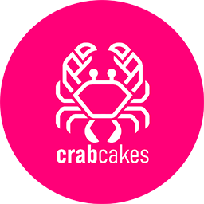

<div align="center">



### Project Development Environment
Your project has its own group chat. Your agents are team members.
Your social media style feed is the dashboard.

[](https://docs.gtk.org/gtk4/)
[](https://www.python.org/)
[](LICENSE)
[](tests/)

</div>

---

## What is it?

CrabCakes is a native Linux desktop app that reimagines software development as a group chat — where some of your teammates happen to be AI agents.

Open a project. Assign the team of Agents. You type a message, it fans out to everyone. Agents respond, collaborate, write code, review each other's work — and you see all of it happen in real time in the social media style Project Feed.

**It runs standalone.** Two built-in coding agents — Coder and Debugger — work locally on your machine with full file access and shell execution. No cloud, no account, no API key required to start. Connect to [OpenClaw](https://github.com/openclaw/openclaw) and your remote agents join seamlessly — but you don't have to.

This is the first **PDE** — a Project Development Environment.

---

## ✨ Features

### 💬 Project Group Chat

Open a project and the team appears. Every member — you, Coder, Debugger, your remote agents — shares a single conversation. Messages fan out to everyone. Responses route back. You see the whole picture.

```
Project: CargoAPI — 4 members online

You:     @Coder — implement the rate limiter
Coder:   On it. Starting with the token bucket approach.
QTR:     @Coder I left a draft in lib/ratelimit.py from last week
Coder:   Good catch. Building on that.
```

### 🤖 Built-In Coding Agents

**Coder** reads your architecture docs, your project context, your conventions. Writes production code. Every file change gets a diff card in the feed.

**Debugger** attaches to failed sessions, analyzes the error, proposes a fix, validates it against your test suite.

Both run locally against OpenAI, MiniMax, Anthropic, or any OpenAI-compatible API. No gateway required.

### 🛡️ Post-Write Enforcement

Every agent write goes through a verification pipeline automatically:

1. **Syntax guard** — `py_compile` / `node --check` runs immediately
2. **Test runner** — detects your framework, runs relevant tests
3. **Lint check** — runs your configured linter on changed files

If anything fails, the agent gets the error and self-corrects. No prompts, no reminders, no human intervention.

### 📰 Project Feed

Every significant action generates a **card** — not a wall of text, not a terminal dump. A scannable, actionable signal.

- **Diff cards** — file changed. Shows +/− counts, full unified diff, one-click review.
- **Task cards** — created, started, completed, blocked.
- **Review cards** — checkpoint diff ready for your accept/reject.
- **Agent action cards** — consultation opens, closes, decisions logged.

### 🔍 Git-Backed Code Review

Every agent write is checkpointed before it reaches your codebase:

1. **Checkpoint** — `git add -A` against the last clean state
2. **Diff** — full unified diff, file by file, hunk by hunk
3. **Accept / Reject** — Accept commits. Reject resets to the checkpoint SHA.

Agents keep working while you review. Multiple agents can write simultaneously — each on its own branch. Nothing touches your code until you approve it.

### 🧠 Convergence Detection

Agents always respond. The hard part is knowing when they're *done*.

CrabCakes runs a **Random Forest classifier** (200 trees) trained on 266 real multi-agent conversations. After every agent response, it extracts 10 behavioral signals from the conversation and runs them through the model to get a stop probability:

| Signal | What it measures |
|--------|-----------------|
| **Shannon entropy** | Vocabulary diversity — diverse words = substantive response |
| **Perplexity proxy** | Entropy × word diversity combined |
| **Average diversity** | Unique-to-total word ratio across all turns |
| **Length trend** | Is the last response shorter than average? (winding down) |
| **Content ratio** | Fraction of non-stopword words (task-focused vs. filler) |
| **Polite fraction** | "Thanks", "confirmed", "done" — closing signals |
| **Last sentence shape** | Short final sentences = strong stop signal |
| **TF-IDF vs. previous** | Did the vocabulary shift from the last response? |
| **TF-IDF vs. history** | Did the vocabulary shift from the whole conversation? |
| **Last sentence dominance** | Is most of the response in one short closing line? |

The model doesn't use hard turn limits or magic keywords. It reads the *shape* of the conversation — are responses getting shorter? Is the vocabulary shifting? Is the last response mostly politeness? — and decides based on patterns learned from real data.

Three stacked layers make the final call:

1. **Turns ≤ 2:** always continue — a conversation needs at least question → answer → acknowledge
2. **Turns 3–14:** Random Forest decides — stop if P(stop) ≥ 0.50
3. **Turn ≥ 15:** hard stop — safety valve against runaway loops

**99.1% accuracy.** Sub-millisecond inference. Runs entirely locally, no cloud API. The model and TF-IDF vectorizer ship as `.pkl` files — loaded once at import time, no training on startup.

### 📋 Task System

Full task management baked into the project feed:

| Command | Result |
|---------|--------|
| `` `task @Coder — implement auth middleware `` | Creates + assigns task |
| `` `start #3 `` | Begins work, emits card to feed |
| `` `done #3 — all tests passing `` | Closes with notes |
| `` `blocked #7 — waiting on API spec `` | Escalates to feed |
| `` `tasks `` | Full project task board |

Every action emits a structured card. Full history, always visible.

### 🤝 Agent-to-Agent Collaboration

Agents consult each other through the same command system you use:

```
Coder:   `ask @Debugger — is this edge case in the auth flow handled?
Debugger: Looking... no, there's a gap when the token is expired but refresh hasn't failed.
Coder:   Good catch. Fixing now.
```

The `@mention` system, `ask`, `delegate`, `stop`, and `tell` commands work identically for humans and agents. Agents collaborate and you watch it happen.

### 🫧 Activity Bubbles

Real-time visibility into what your agents are doing. Centered, pill-shaped indicators appear as tools run:

```
        ┌──────────────┐
        │  thinking...  │
        └──────────────┘
           ┌─────────┐
           │  search  │
           └─────────┘
        ┌──────────────┐
        │  read  83ms  │
        └──────────────┘
```

Tool calls, command output, file patches, plan updates, approval requests — all surface as clean, color-coded indicators. No emoji soup. No visual noise.

### 🔐 Exec Approval Gate

Shell commands go through an approval gate. Dangerous operations — file deletions, system changes, network calls — surface for your review before execution. You see the exact command, the host, and the reason. One click to approve or deny.

### ✦ Prompt Improvement

Every prompt in the library can be refined before loading. The built-in prompt improver rewrites your template with better structure, clearer instructions, and sharper edge cases. Templates support variables (`{{PROJECT_NAME}}`, `{{TEAM}}`, `{{GIT_STATE}}`) that fill from project context.

### 🎙️ Voice Input

Push-to-talk via faster-whisper. No cloud, no latency. Hold a key, speak, release — your words land in the input box. Built for when you're mid-flow and reaching for the keyboard would break your concentration.

### 📂 Project Browser

File tree in the left panel. Open any file, browse directories, see what's changed. Your project is always one click away. Create new projects, manage team membership — all in the sidebar.

---

## 📚 Prompt Library

Every template in your `prompts/` directory is one click away. Star the ones you reach for — they float to the top. Browse, search, filter. Click once to preview. **Double-click** to load into the input box, edit freely, then send. Variables like `{{PROJECT_NAME}}`, `{{TEAM}}`, and `{{GIT_STATE}}` fill automatically from your current project context.

Last-used tracking means your most-fired prompts surface first. No hunting.

## 🔎 Agent Discovery

Connect to an OpenClaw gateway and CrabCakes pulls the full agent roster — every connected agent becomes a tab, ready to chat. Remote agents blend seamlessly into project group chats alongside your local Coder and Debugger. The split between local and remote is invisible to the user. It just works.

## 👥 Membership Toggles

Who do you need on this project? The Agents tab has +/− buttons for every agent. Add someone mid-sprint. Remove them when the work is done. Membership changes fan out immediately — the project group chat updates in real time, no restart, no reconfigure.

## 🤝 Collaboration Commands

The same command surface humans and agents use. Drop one of these into any chat and watch it route:

- `` `ask @Debugger — is this edge case covered? `` → Debugger gets the ping, responds inline
- `` `delegate @Coder — refactor the auth layer `` → work assigned, tracked
- `` `stop @Coder `` → graceful halt
- `` `tell @Coder — the spec changed, check the new ARCHITECTURE.md `` → context injection

Agents see these commands the same way humans do. They respond the same way. The collaboration layer is uniform.

## 🏗️ Custom Agent Builder

Coder and Debugger are just the starting point. Drop a YAML file into `~/.config/crabcakes/agents/` and a new agent appears — with your choice of provider, model, system prompt role, emoji, color, and tool set. Or use the built-in Agent Builder UI to configure one visually. No code required. No fork needed. Agents load at startup, no restart.

## 🏷️ Feed Card Taxonomy

Every event in the project feed is a card — typed, structured, scannable. Eleven types, each with a distinct visual signature:

| Card | What it signals |
|------|----------------|
| `git_commit` | Agent committed a change — shows message + author |
| `diff` | File edited — +/− counts, full unified diff, one-click review |
| `file_created` | New file landed in the project |
| `file_modified` | Existing file touched |
| `file_deleted` | Something was removed |
| `dir_created` | Directory added |
| `dir_deleted` | Directory removed |
| `task` | Created, started, completed, or blocked |
| `agent_action` | Consultation opened/closed, key decision logged |
| `audit_report` | Post-write enforcement result — syntax, test, lint verdict |
| `system` | Lifecycle events — connect, disconnect, agent join |

Agents emit cards. You read the feed. Nothing slips through.

## 📂 Project Creation & Onboarding

New project? Create it from the sidebar. It scaffolds `AGENTS.md` and `.crabcakes/` for you. From that point on, every time you open it, the system builds context automatically:

- Scans all project files (respecting `.gitignore`), caps at ~50K characters
- Loads `prompts/system/{role}.md` for each agent's role template
- Injects `.crabcakes/` documentation into every context window
- If `.crabcakes/agent-system-prompt.md` exists, it overrides the default — fully custom per-project instructions
- Falls back to the project's own `AGENTS.md` if no custom prompt is found

Agents don't start cold. They start knowing your codebase.

**The Onboarding Flow**

When Coder or Debugger first touches a new project, it detects an empty manifest (`project.md` still a skeleton of HTML comments, `context.md` blank) and triggers an onboarding interview — defined entirely in `prompts/system/project-onboarding.md`, not in code. Edit the template to change the experience.

The interview asks one or two questions at a time, conversationally. It never blocks work — if you say "skip it, help me with this," it helps and circles back. After the interview, it writes answers back to `project.md` (`Purpose`, `Stack`, `Entry Points`, `Conventions` sections) and appends a dated entry to `context.md`.

Once `project.md` has real content, the onboarding template stops loading automatically. The system prompt composition order:

1. `default.md`
2. `project-awareness.md` (if project active)
3. `project-onboarding.md` (if project active AND not yet onboarded)
4. `code-review.md` (if review mode on)
5. Role template — `coder.md` / `debugger.md` / etc.

## 🎨 Pango Markup Rendering

Chat messages pass through a two-stage render pipeline: `escape_for_pango()` first (XML-aware, preserves known Pango tags, rejects anything else), then `format_markdown()` which converts inline markdown to GTK Pango Markup:

- `**bold**` → `<b>bold</b>`
- `*italic*` → `<i>italic</i>`
- `` `code` `` → `<tt>code</tt>`
- `~~strike~~` → `<s>strike</s>`
- `[text](url)` → clickable `<a href="url"><u>text</u></a>`
- Bare URLs → auto-linked

Output is safe, structured, and native GTK — no HTML iframe, no webview, no sanitization theatre.

---

## 🧠 Self-Improvement System

Coder learns. Not metaphorically — structurally. The self-improvement system is a five-layer feedback engine that makes Coder measurably better every time it gets something wrong.

### Layer 1 — Bug Journal

Every mistake Coder makes is recorded in `.crabcakes/coder-bugs.md` — a per-project, git-tracked journal. Each entry captures the bug, the root cause, the fix, and the lesson. This isn't a generic pitfalls list. It's Coder's actual scar tissue.

Format:
```markdown
## Bug #7 — 2026-05-18 — watcher.py
**Task:** Fix moved event detection in DebouncedHandler
**Mistake:** Used `if dest_path is not None` — MagicMock objects are always truthy
**Fix:** Changed to `isinstance(dest_path, str) and dest_path`
**Pattern:** mock-truthiness
```

This file is injected into Coder's system prompt at the start of every task. The pattern tags (`mock-truthiness`, `sed-overmatch`, `partial-test-run`) are the seed data that upper layers consume.

### Layer 2 — Project Rules

Like Claude Code's `CLAUDE.md` — a per-project rules file that tells Coder how this specific codebase is wired. Python version, venv activation, test naming conventions, known gotchas. Injected alongside the bug journal so Coder starts every session knowing the terrain.

### Layer 3 — Auto-Test Enforcement

Not a prompt request. A structural guarantee. After Coder writes any `.py` file, the system automatically finds and runs the associated test file, injects the result into Coder's tool output, and forces a response before the task can close. Coder physically cannot forget to run tests. Infrastructure enforces what prompts cannot.

### Layer 4 — Structured Feedback Protocol

When a reviewer finds a bug, the report follows a machine-parseable format:

```
## Audit Report
**File:** install.sh:57
**Severity:** bug
**Bug:** sed replaces all "python3" including inside venv path
**Pattern:** sed-overmatch
```

This format auto-populates the bug journal, appends to the review log (`.crabcakes/review-log.jsonl`), and feeds directly into Layer 5. Feedback becomes a data artifact, not a conversation that scrolls away.

### Layer 5 — Dream Consolidation

The system runs a nightly autonomous cycle during idle time. It reads the accumulated bug journal, review log, and recent session data, identifies patterns across reviews, and evolves Coder's prompts accordingly:

- Recurring `mock-truthiness` bugs → new Common Pitfall entry in `coder.md`
- Repeated `sed-overmatch` → new gotcha in `coder-rules.md`
- Resolved patterns → archived, not deleted

Proposed changes to `coder.md` require human approval. Project rules and bug journal updates apply automatically. The system gets smarter while everyone sleeps.

**Research basis:** This system draws from OpenAI's self-evolving agents cookbook (grade → meta-prompt → rewrite), Imbue's Darwinian evolver (failure-driven mutations outperform random perturbation by 2–3x), and VILA-Lab's finding that 98.4% of a capable agent is deterministic infrastructure, not the model itself.

---

## 🚀 Coming Soon

These features are designed, specified, and ready to build:

### 🔌 MCP Server Integration

Connect any [Model Context Protocol](https://modelcontextprotocol.io/) server to your agents. GitHub, PostgreSQL, Sentry, Puppeteer, Git — thousands of MCP servers become tool libraries. Agents get structured, well-described tools with proper schemas instead of raw shell commands.

Your Coder agent configured with the GitHub MCP server gets `create_issue`, `search_repositories`, `list_commits` — operations the built-in tools can't do. Your Debugger with PostgreSQL and Sentry can query live databases and inspect production errors.

*Spec: [`docs/proposals/PROPOSAL-mcp-client-integration.md`](docs/proposals/PROPOSAL-mcp-client-integration.md)*

### 🏗️ Implementation Engine

The task system becomes a deterministic build cycle: **PICK → BUILD → TEST → REVIEW → RECORD → repeat**. One agent or many, the engine runs the same way. Tasks are persisted to `.crabcakes/` and survive app restarts. Any agent can resume where another left off.

*Spec: [`docs/proposals/PROPOSAL-implementation-engine.md`](docs/proposals/PROPOSAL-implementation-engine.md)*

---

## 🏗️ Architecture

Strict layer separation. The codebase is readable, testable, and trustworthy:

```
┌─────────────────────────────────────────────────────────┐
│  ui/                                                   │
│  GTK4 widgets · handlers · views                       │
│  Never imports gateway/ or models/                     │
├─────────────────────────────────────────────────────────┤
│  gateway/        models/           agent/              │
│  WebSocket       Pure data         Local agent         │
│  v3 device auth  No UI deps        runtime             │
│  No UI deps      No gateway deps   No UI deps          │
├─────────────────────────────────────────────────────────┤
│  converge/                                           │
│  Convergence engine · Random Forest · 200 trees        │
├─────────────────────────────────────────────────────────┤
│  utils/                                               │
│  Pure Python · file I/O · prompts · STT · config       │
└─────────────────────────────────────────────────────────┘
```

Every handler follows the same pattern: receives dependencies via setters, never imports from other handlers. `window.py` is the composition root — it creates everything and wires the callbacks. No circular dependencies. No hidden state.

---

## ⚡ Getting Started

### Prerequisites

```bash
# System packages (Ubuntu/Debian)
sudo apt install python3-gi python3-gi-cairo gir1.2-gtk-4.0 libgirepository1.0-dev

# Python packages
pip install pygobject websockets cryptography gitpython
```

### Run

```bash
git clone https://github.com/qsmtco/crabcakes.git
cd crabcakes

# Launch — works immediately, no gateway required
python main.py

# Optional: connect to OpenClaw for remote agents
openclaw gateway start
# Then click Connect in the CrabCakes toolbar
```

### First Steps

1. **Browse prompts** in the left sidebar — click any system prompt to load it
2. **Start a local conversation** — the Coder agent is ready out of the box
3. **Open a project** — click Projects tab → select a directory → the team assembles
4. **Try voice input** — push and hold the mic button, speak, release

---

## ⚙️ Configuration

| Variable | Default | Purpose |
|----------|---------|---------|
| `CRABCAKES_GATEWAY_URL` | `ws://localhost:18789` | OpenClaw gateway URL |
| `CRABCAKES_PROJECTS_DIR` | `~/projects` | Root directory for projects |
| `WHISPER_CLI` | `~/whisper.cpp/build/bin/whisper-cli` | Whisper binary for voice |
| `WHISPER_MODEL` | `~/whisper.cpp/models/ggml-large-v3-turbo.bin` | Whisper model |
| `CRABCAKES_DEBUG` | `0` | Set `1` for verbose output |

Agent configs live in `~/.config/crabcakes/`. LLM provider settings in `agent.json`.

---

## 🧪 Testing

```bash
pytest                    # run all tests
pytest tests/test_*.py    # run specific suite
pytest -x                 # stop on first failure
```

1600+ tests covering all handlers, models, rendering, convergence, and the agent runtime.

---

## 📁 Project Structure

```
crabcakes/
├── main.py                          # Entry point
├── gateway/
│   └── client.py                    # WebSocket client · v3 device auth
├── models/
│   ├── agents.py                    # Agent manager · colors · sessions
│   ├── routing.py                   # Session → project routing
│   ├── command.py                   # Command parsing · registry
│   ├── conversation.py              # Conversation + Message dataclasses
│   ├── task.py                      # Task + TaskStore
│   ├── feed_card.py                 # Feed card data
│   ├── activity.py                  # Activity bubble data
│   └── review_state.py              # Review session state
├── agent/
│   ├── runtime.py                   # Tool loop · streaming · cost tracking
│   ├── tools.py                     # 8 built-in tools
│   ├── context.py                   # System prompt builder
│   ├── config.py                    # Provider config
│   ├── enforcement.py               # Post-write verification
│   └── special_agents.py            # Coder + Debugger definitions
├── converge/
│   ├── converge.py                  # Random Forest · 200 trees · 10 signals
│   └── model.pkl                    # Pre-trained model
├── ui/
│   ├── window.py                    # Main window · composition root
│   ├── styles.py                    # All CSS · single source of truth
│   ├── handlers/                    # Extracted logic
│   │   ├── chat_handler.py          # Send · fan-out · routing
│   │   ├── chat_render_handler.py   # Markdown · bubbles · activity
│   │   ├── activity_handler.py      # 6-state machine · bubbles
│   │   ├── command_handler.py       # Backtick command parser
│   │   ├── review_handler.py        # Review lifecycle
│   │   ├── task_handler.py          # Task CRUD
│   │   ├── collab_handler.py        # ask / delegate / stop / tell
│   │   ├── agent_runtime_handler.py # Local agent bridge
│   │   └── ...                      # gateway, media, project, etc.
│   └── views/
│       ├── chat_bubble.py           # Bubble factories + rendering
│       ├── feed_card.py             # Card widget factory
│       ├── diff_card.py             # Unified diff viewer
│       ├── feedbar.py               # Response status bar
│       ├── left_panel.py            # Sidebar · Prompts/Agents/Projects
│       ├── main_content.py          # Chat tabs + input
│       └── ...                      # file tree, review bar, etc.
├── utils/
│   ├── escaping.py                  # Pango-aware XML escape
│   ├── markdown.py                  # Markdown → Pango markup
│   ├── git_ops.py                   # GitPython wrapper
│   ├── diff_parser.py               # Unified diff parser
│   ├── prompt_loader.py             # System prompt composer
│   ├── stt.py                       # Voice input engine
│   └── ...                          # config, projects, icons, etc.
├── prompts/
│   └── system/                      # System prompt templates
│       ├── coder.md                 # Coder agent instructions
│       ├── debugger.md              # Debugger agent instructions
│       ├── collab.md                # A2A collaboration protocol
│       └── ...
└── tests/                           # 1600+ tests
```

---

## 🎯 Why CrabCakes?

Every tool today makes the same trade-off: agents work alone (fast, uncontrolled) or humans supervise every action (safe, unscalable). The moment you want two agents to collaborate, you're duct-taping prompts together and hoping nothing breaks.

The real problem isn't making agents do things. It's **orchestrating them as a team**.

CrabCakes solves this by making the project itself the social context. Not a prompt you feed them. Not a task list you manage. The actual project — its files, its history, its team — is what they operate inside. You see everything. You control what gets merged. Agents collaborate with each other and you watch it happen in real time.

> **The project IS the chat. The feed IS the dashboard. Agents are teammates you manage.**

---

## 🦀 About the Name

Named after the Chesapeake Bay delicacy — sweet, rich, and built from parts other people throw away.

---

<div align="center">

*Part of the [Qontinuum Bridge](https://github.com/qsmtco) project.*

**CrabCakes — where your project is the chat.**

*The first PDE.*

</div>
