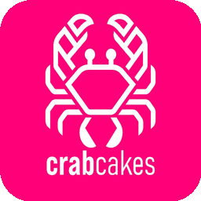
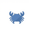
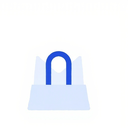
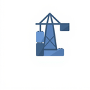
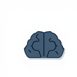

<div align="center">



# CrabCakes:PDE

### The first **Project Development Environment**.

*Where your project is the chat. Where your feed is the dashboard. Where agents are teammates you manage.*

[](https://docs.gtk.org/gtk4/)
[](https://www.python.org/)
[](LICENSE)
[](tests/)
[](ui/handlers/)
[](tests/)

<br>

> *"Other tools make agents do things. CrabCakes orchestrates them as a team."*

<br>

[Quick Start](#-quick-start) · [Features](#-whats-inside) · [Architecture](#-architecture) · [The PDE Thesis](#-why-a-pde) · [Built for Agents](#-built-for-agents)

</div>

---

##  What is CrabCakes?

**CrabCakes is a native Linux desktop app that reimagines software development as a group chat — where some of your teammates happen to be AI agents.**

Open a project. The team appears. You type a message, it fans out to every member. Agents respond, collaborate, write code, review each other's work, and you see all of it happen in real time in a **social-media-style Project Feed**.

```
 Project: CargoAPI · 4 online

  You     │  @Coder — implement the rate limiter
  Coder   │  On it. Starting with the token bucket approach.
  QTR     │  I left a draft in lib/ratelimit.py from last week
  Coder   │  Good catch. Building on that.
  ─────────────────────────────────────────
  [type a message...]                   
```

**It runs standalone.** Two built-in coding agents — **Coder** and **Debugger** — work locally on your machine with full file access and shell execution. No cloud, no account, no API key required to start. Connect to [OpenClaw](https://github.com/openclaw/openclaw) and your remote agents join seamlessly — but you don't have to.

This is the first **PDE** — a *Project Development Environment*.

> CrabCakes is not a harness. A harness wraps API calls. CrabCakes is where AI and humans build software together. The **project** is the first-class citizen. Agents, humans, git, files, reviews — those all orbit the project.

---

##  What's Inside

###  Project Group Chat

Every member — you, Coder, Debugger, your remote agents — shares a single conversation. Messages fan out. Responses route back. You see the whole picture. Per-tab routing means project discussions stay in project tabs and agent queries stay in agent tabs, automatically.

- **@mentions** that resolve to specific agents or broadcast to the whole project
- **Threaded conversation history** persisted per project
- **Streaming responses** with typewriter-style incremental rendering
- **Markdown → Pango markup** pipeline — bold, italic, code, links, strikethrough, all native GTK, no webview, no sanitization theater

###  Built-In Coding Agents

**Coder** reads your architecture docs, your project context, your conventions. Writes production code. Every file change gets a diff card in the feed.

**Debugger** attaches to failed sessions, analyzes the error, proposes a fix, validates it against your test suite.

Both run locally against **OpenAI**, **MiniMax**, **Anthropic**, or any OpenAI-compatible API. No gateway required.

> Built-in agents are just YAML files in `prompts/default_agents/`. Drop a new one in `~/.config/crabcakes/agents/` and it appears in your team — with your choice of provider, model, system prompt, emoji, color, and tool set. No code required. No fork needed.

###  Post-Write Enforcement

Every agent write goes through a **3-tier verification pipeline** automatically — not a prompt request, a structural guarantee:

| Tier | What runs | When |
|------|-----------|------|
| **Syntax guard** | `py_compile` · `node --check` · syntax-specific shell | Immediately on write |
| **Test runner** | Detects your framework (pytest, npm test, go test) · runs relevant tests | After syntax passes |
| **Lint check** | Runs your configured linter on changed files | After tests pass |

If anything fails, the agent gets the error and self-corrects. **No prompts, no reminders, no human intervention.** Infrastructure enforces what prompts cannot.

###  Project Feed

Every significant action generates a **card** — not a wall of text, not a terminal dump. A scannable, actionable signal. Eleven typed cards, each with a distinct visual signature:

| Card | What it signals |
|------|----------------|
| `git_commit` | Agent committed a change — message + author + SHA |
| `diff` | File edited — +/− counts, full unified diff, one-click review |
| `file_created` | New file landed in the project |
| `file_modified` | Existing file touched |
| `file_deleted` | Something was removed |
| `dir_created` | Directory added |
| `dir_deleted` | Directory removed |
| `task` | Created, started, completed, or blocked |
| `agent_action` | Consultation opened/closed, key decision logged |
| `audit_report` | Post-write enforcement result — syntax, test, lint verdict |
| `system` | Lifecycle events — connect, disconnect, agent join |

Agents emit cards. You read the feed. **Nothing slips through.**

###  Git-Backed Code Review

Every agent write is checkpointed before it reaches your codebase:

1. **Checkpoint** — `git add -A` against the last clean state
2. **Diff** — full unified diff, file by file, hunk by hunk
3. **Accept / Reject** — Accept commits. Reject resets to the checkpoint SHA.

Agents keep working while you review. Multiple agents can write simultaneously — each on its own branch. **Nothing touches your code until you approve it.**

###  Activity Bubbles

Real-time visibility into what your agents are doing. Centered, pill-shaped indicators appear as tools run:

```
              ┌──────────────┐
              │  thinking...  │
              └──────────────┘
                 ┌─────────┐
                 │  search  │
                 └─────────┘
              ┌──────────────┐
              │  read  83ms  │
              └──────────────┘
```

Eight activity types: lifecycle, tool start, tool end, tool error, plan updates, approval requests, command output, file patches. Color-coded by status. No emoji soup. No visual noise.

###  Agent-to-Agent Collaboration

Agents consult each other through the same command system you use:

```
  Coder     │  `ask @Debugger — is this edge case in the auth flow handled?
  Debugger  │  Looking... no, there's a gap when the token is expired
             │  but refresh hasn't failed.
  Coder     │  Good catch. Fixing now.
```

The `@mention` system, `ask`, `delegate`, `stop`, and `tell` commands work identically for humans and agents. Agents collaborate and you watch it happen. **The collaboration layer is uniform.**

###  Task System

Full task management baked into the project feed:

| Command | Result |
|---------|--------|
| `` `task @Coder — implement auth middleware `` | Creates + assigns task |
| `` `start #3 `` | Begins work, emits card to feed |
| `` `done #3 — all tests passing `` | Closes with notes |
| `` `blocked #7 — waiting on API spec `` | Escalates to feed |
| `` `tasks `` | Full project task board |

Every action emits a structured card. Full history, always visible.

###  Exec Approval Gate

Shell commands go through an approval gate. Dangerous operations — file deletions, system changes, network calls — surface for your review before execution. You see the exact command, the host, and the reason. **One click to approve or deny.** No silent shell access. No surprise side effects.

###  Prompt Improvement

Every prompt in the library can be refined before loading. The built-in prompt improver rewrites your template with better structure, clearer instructions, and sharper edge cases. Templates support variables (`{{PROJECT_NAME}}`, `{{TEAM}}`, `{{GIT_STATE}}`) that fill from project context.

###  Voice Input

Push-to-talk via **faster-whisper**. No cloud, no latency. Hold a key, speak, release — your words land in the input box. Built for when you're mid-flow and reaching for the keyboard would break your concentration.

###  MCP Server Integration

Connect any [Model Context Protocol](https://modelcontextprotocol.io/) server to your agents. GitHub, PostgreSQL, Sentry, Puppeteer, Filesystem, Memory — any MCP server becomes a tool library. Agents get structured, well-described tools with proper schemas instead of raw shell commands.

**What's implemented:**
- **stdio transport** — MCP clients launch as subprocesses; CrabCakes talks to them over stdin/stdout
- **Tool discovery** — agents automatically discover all tools a server exposes (the Memory server exposes 9 tools: `create_entities`, `read_graph`, `search_nodes`, and more)
- **Hot-reload** — add or remove a server from an agent's config in the Edit Agent dialog; no restart needed. The runtime reconnects on the next message
- **Works for all agents** — any special agent (Coder, Debugger, Test Engineer, etc.) can be MCP-enabled per-agent in `~/.config/crabcakes/agents/{agent}.yaml`

```yaml
# ~/.config/crabcakes/agents/coder.yaml
mcp_servers:
  - memory      # Knowledge graph — 9 tools
  - filesystem  # Local file access
```

The **Memory server is verified working end-to-end** through the UI. Agents can create, query, and link entities in a persistent knowledge graph that survives across sessions.

###  Project Browser & Team Management

- **File tree** in the left panel. Open any file, browse directories, see what's changed.
- **Project creation** scaffolds `AGENTS.md` and `.crabcakes/` for you.
- **Membership toggles** — who do you need on this project? Add someone mid-sprint. Remove them when the work is done. Changes fan out immediately, no restart, no reconfigure.
- **Agent Discovery** — connect to an OpenClaw gateway and CrabCakes pulls the full agent roster. Remote agents blend seamlessly into project group chats alongside your local Coder and Debugger. The split between local and remote is invisible to the user.

###  Custom Agent Builder

Coder and Debugger are just the starting point. Use the built-in **Agent Builder UI** to configure a new agent visually — pick a provider, model, system prompt role, emoji, color, tool set. Or drop a YAML file into `~/.config/crabcakes/agents/`. **No code required. No fork needed.** Agents load at startup.

---

##  Self-Improvement System

Coder learns. Not metaphorically — **structurally.** A five-layer feedback engine that makes Coder measurably better every time it gets something wrong.

### Layer 1 — Bug Journal

Every mistake Coder makes is recorded in `.crabcakes/coder-bugs.md` — a per-project, git-tracked journal. Each entry captures the bug, the root cause, the fix, and the lesson. This isn't a generic pitfalls list. **It's Coder's actual scar tissue.**

```markdown
## Bug #7 — 2026-05-18 — watcher.py
**Task:** Fix moved event detection in DebouncedHandler
**Mistake:** Used `if dest_path is not None` — MagicMock objects are always truthy
**Fix:** Changed to `isinstance(dest_path, str) and dest_path`
**Pattern:** mock-truthiness
```

This file is injected into Coder's system prompt at the start of every task. The pattern tags (`mock-truthiness`, `sed-overmatch`, `partial-test-run`, `off-by-one`, `race-condition`, `type-confusion`) are the seed data that upper layers consume.

### Layer 2 — Project Rules

Like Claude Code's `CLAUDE.md` — a per-project rules file that tells Coder how this specific codebase is wired. Python version, venv activation, test naming conventions, known gotchas. Injected alongside the bug journal so Coder starts every session knowing the terrain.

### Layer 3 — Auto-Test Enforcement

**Not a prompt request. A structural guarantee.** After Coder writes any `.py` file, the system automatically finds and runs the associated test file, injects the result into Coder's tool output, and forces a response before the task can close. Coder physically cannot forget to run tests.

### Layer 4 — Structured Feedback Protocol

When a reviewer finds a bug, the report follows a machine-parseable format:

```
## Audit Report
**File:** install.sh:57
**Severity:** bug
**Bug:** sed replaces all "python3" including inside venv path
**Pattern:** sed-overmatch
```

This format auto-populates the bug journal, appends to the review log (`.crabcakes/review-log.jsonl`), and feeds directly into Layer 5. **Feedback becomes a data artifact, not a conversation that scrolls away.**

### Layer 5 — Dream Consolidation

The system runs a nightly autonomous cycle during idle time. It reads the accumulated bug journal, review log, and recent session data, identifies patterns across reviews, and evolves Coder's prompts accordingly:

- Recurring `mock-truthiness` bugs → new Common Pitfall entry in `coder.md`
- Repeated `sed-overmatch` → new gotcha in `coder-rules.md`
- Resolved patterns → archived, not deleted

Proposed changes to `coder.md` require human approval. Project rules and bug journal updates apply automatically. **The system gets smarter while everyone sleeps.**

> **Research basis:** This system draws from OpenAI's self-evolving agents cookbook (grade → meta-prompt → rewrite), Imbue's Darwinian evolver (failure-driven mutations outperform random perturbation by 2–3x), and VILA-Lab's finding that 98.4% of a capable agent is deterministic infrastructure, not the model itself.

---

##  Quick Start

### Prerequisites

```bash
# System packages (Ubuntu / Debian)
sudo apt install python3-gi python3-gi-cairo gir1.2-gtk-4.0 libgirepository1.0-dev

# Python packages
pip install pygobject websockets cryptography gitpython
```

### Run

```bash
git clone https://github.com/qsmtco/crabcakes.git
cd crabcakes

# Launch — works immediately, no gateway required
python main.py

# Optional: connect to OpenClaw for remote agents
openclaw gateway start
# Then click Connect in the CrabCakes toolbar
```

### First Steps

1. **Browse prompts** in the left sidebar — click any system prompt to load it
2. **Start a local conversation** — the Coder agent is ready out of the box
3. **Open a project** — click Projects tab → select a directory → the team assembles
4. **Try voice input** — push and hold the mic button, speak, release
5. **Add an MCP server** — right-click an agent card → Edit → check a server

---

##  Configuration

| Variable | Default | Purpose |
|----------|---------|---------|
| `CRABCAKES_GATEWAY_URL` | `ws://localhost:18789` | OpenClaw gateway URL |
| `CRABCAKES_PROJECTS_DIR` | `~/projects` | Root directory for projects |
| `WHISPER_CLI` | `~/whisper.cpp/build/bin/whisper-cli` | Whisper binary for voice |
| `WHISPER_MODEL` | `~/whisper.cpp/models/ggml-large-v3-turbo.bin` | Whisper model |
| `CRABCAKES_DEBUG` | `0` | Set `1` for verbose logging |

Agent configs live in `~/.config/crabcakes/`. LLM provider settings in `agent.json`. MCP server registry in `mcp-servers.json`. Everything is plain files — version-controllable, diffable, greppable.

---

##  Architecture

**Strict layer separation.** The codebase is readable, testable, and trustworthy:

```
┌─────────────────────────────────────────────────────────┐
│  ui/                                                    │
│  GTK4 widgets · handlers · views                        │
│  Never imports gateway/ or models/                      │
├─────────────────────────────────────────────────────────┤
│  gateway/        models/           agent/               │
│  WebSocket       Pure data         Local agent          │
│  v3 device auth  No UI deps        runtime              │
│  No UI deps      No gateway deps   No UI deps           │
├─────────────────────────────────────────────────────────┤
│  utils/                                                 │
│  Pure Python · file I/O · prompts · STT · MCP · config  │
└─────────────────────────────────────────────────────────┘
```

### The 21-Handler Pattern

Every handler follows the same pattern: **receives dependencies via setters, never imports from other handlers.** `window.py` is the composition root — it creates everything and wires the callbacks. No circular dependencies. No hidden state.

```
ui/handlers/
├── chat_handler.py            Send · fan-out · routing
├── chat_render_handler.py     Markdown · bubbles · streaming
├── activity_handler.py        6-state activity machine
├── command_handler.py         Backtick command parser
├── review_handler.py          Review lifecycle
├── task_handler.py            Task CRUD
├── collab_handler.py          ask / delegate / stop / tell
├── agent_runtime_handler.py   Local agent bridge
├── agent_command_handler.py   Audit reports · enforcement
├── agent_builder_handler.py   Custom agent config UI
├── agent_list_handler.py      Agent roster
├── project_handler.py         Project open/close/create
├── project_list_handler.py    Project browser
├── prompts_handler.py         Prompt library
├── gateway_handler.py         WebSocket lifecycle
├── connection_sync_handler.py Post-connect wiring
├── forward_handler.py         Agent-to-agent forwarding
├── crabwatch_handler.py       File system watcher
├── session_handler.py         Session management
├── media_handler.py           STT + prompt improvement
├── input_toolbar_handler.py   Chat input controls
└── feed_handler.py            Feed card lifecycle
```

### Project Layout

```
crabcakes/
├── main.py                          # Entry point
├── gateway/
│   └── client.py                    # WebSocket client · v3 device auth
├── models/                          # Pure data — no UI deps
│   ├── agents.py                    # Agent manager · colors · sessions
│   ├── routing.py                   # Session → project routing
│   ├── command.py                   # Command parsing · registry
│   ├── conversation.py              # Conversation + Message dataclasses
│   ├── conversation_snapshot.py     # Serializable snapshots
│   ├── task.py                      # Task + TaskStore
│   ├── feed_card.py                 # Feed card data
│   ├── activity.py                  # Activity bubble data
│   ├── review_state.py              # Review session state
│   ├── streaming.py                 # Streaming bubble state
│   ├── colors.py                    # Agent color rotation
│   └── team.py                      # Team membership
├── agent/                           # Local agent runtime
│   ├── runtime.py                   # Tool loop · streaming · cost tracking
│   ├── tools.py                     # 8 built-in tools
│   ├── context.py                   # System prompt builder
│   ├── config.py                    # Provider config
│   ├── enforcement.py               # Post-write verification
│   └── special_agents.py            # Coder + Debugger definitions
├── utils/                           # Pure Python utilities
│   ├── escaping.py                  # Pango-aware XML escape
│   ├── markdown.py                  # Markdown → Pango markup
│   ├── git_ops.py                   # GitPython wrapper
│   ├── diff_parser.py               # Unified diff parser
│   ├── prompt_loader.py             # System prompt composer
│   ├── stt.py                       # Voice input engine
│   ├── mcp_client.py                # MCP stdio transport
│   ├── mcp_config.py                # MCP server registry
│   ├── agent_defs.py                # User agent YAML loader
│   ├── feedback_processor.py        # Audit report processing
│   ├── review_log.py                # Review log writer
│   ├── project_awareness.py         # Project context scanner
│   ├── projects.py                  # Project CRUD
│   ├── improve.py                   # Prompt improvement API
│   ├── audit_parser.py              # Audit report parser
│   ├── workflow_state.py            # Task workflow state
│   ├── spellcheck.py                # Inline spellcheck
│   ├── syntax_highlight.py          # Code syntax highlighting
│   ├── favorites.py                 # Prompt favorites
│   ├── image_utils.py               # Image upload
│   ├── quoting.py                   # Message quoting
│   └── feed_store.py                # Feed persistence
├── prompts/
│   ├── system/                      # System prompt templates
│   │   ├── coder.md                 # Coder agent instructions
│   │   ├── debugger.md              # Debugger agent instructions
│   │   ├── collab.md                # A2A collaboration protocol
│   │   ├── project-onboarding.md    # New project interview
│   │   ├── project-awareness.md     # Project context injection
│   │   ├── code-review.md           # Review mode instructions
│   │   └── improve.md               # Prompt improver system prompt
│   └── default_agents/              # Built-in agent YAMLs
│       ├── coder.yaml
│       ├── debugger.yaml
│       └── crabcakes.yaml
├── tests/                           # 1,200+ tests · 0 stale failures
└── docs/                            # Specs · post-mortems · research
```

---

##  Testing

```bash
pytest                    # run all tests
pytest tests/test_*.py    # run specific suite
pytest -x                 # stop on first failure
pytest -k pattern         # filter by name
```

**1,200+ tests** covering all handlers, models, rendering, MCP, the agent runtime, and the full event pipeline. **Zero stale failures** — the suite is kept clean. When an API changes, the tests change with it in the same commit.

---

##  Why a PDE?

Every tool today makes the same trade-off: agents work alone (fast, uncontrolled) or humans supervise every action (safe, unscalable). The moment you want two agents to collaborate, you're duct-taping prompts together and hoping nothing breaks.

The real problem isn't making agents do things. **It's orchestrating them as a team.**

CrabCakes solves this by making the **project itself the social context.** Not a prompt you feed them. Not a task list you manage. The actual project — its files, its history, its team — is what they operate inside. You see everything. You control what gets merged. Agents collaborate with each other and you watch it happen in real time.

> **The project IS the chat. The feed IS the dashboard. Agents are teammates you manage.**

---

##  About the Name

Named after the Chesapeake Bay delicacy — sweet, rich, and built from parts other people throw away.

---

<div align="center">

*Part of the [Qontinuum Bridge](https://github.com/qsmtco) project.*

**CrabCakes — where your project is the chat.**

*The first PDE.*

<br>

[](https://docs.gtk.org/gtk4/)
[](https://www.python.org/)
[](LICENSE)
[](tests/)

</div>
